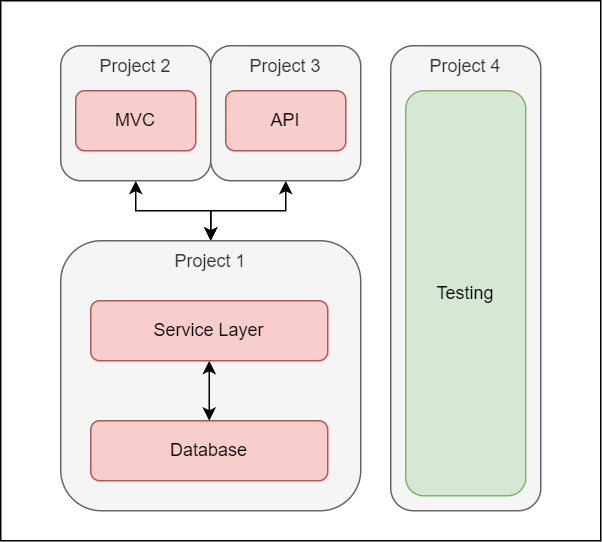

# Issue Tracker
A simple software development issue tracking app. Built using .NET 6 / ASP.NET.

# Solution Architecture


# Setup 
## SQL Server 
Currently, the project is configured to use an SQL server running in a docker container. 

```powershell
  ./DockerScripts/SetupSQLDocker.bat      # Create a new Docker container with an SQL Server on port 1433.
  ./DockerScripts/StartSQLDocker.bat      # Start the container.
  ./DockerScripts/StopSQLDocker.bat       # Stop the running container.
  ./DockerScripts/DestroySQLDocker.bat    # Forcibly stop the container and delete it.
```

To use a different SQL server, modify *IssueTracker/Common/appsettings.json*
and change the *default* connection string and rebuild the application. The connection string below would use a locally installed version of SQL Server.

```json
{
  "ConnectionStrings": {
    "default": "Server=(localdb)\\mssqllocaldb;Database=aspnet-IssueTracker;Trusted_Connection=True;MultipleActiveResultSets=true"
  },
```

## Building
To build the solution from the command line, run the following commands:
```powershell
    cd ./IssueTracker/
    dotnet publish -c Release -o out
```
After the build is complete, run: 
```powershell
    cd ./out/
    ./IssueTracker-WebApp.exe
```
Otherwise, open *./IssueTracker/IssueTracker.sln* in Visual Studio 2022 and run from there.

Eventually, IssueTracker itself will run from a Docker container too (WIP)

## Migration
Database migration shouldn't be necessary as we apply the latest migrations at runtime.

However, if there are issues with the database, try running:
```powershell 
    dotnet tool install dotnet-ef --version 6.0.10   # Ensure the required version of the EF tool is installed locally
    cd ./IssueTracker/IssueTracker-CoreServices
    dotnet dotnet-ef database drop                   # Enter 'Y' when required
    dotnet dotnet-ef database update 
```
